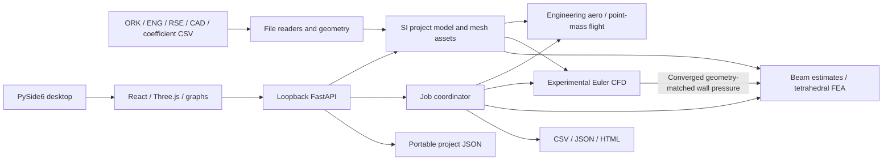

# Architecture

## Application boundary

Rocket Workbench is a local desktop application. QtWebEngine hosts a bundled
React interface; FastAPI serves that interface and a loopback JSON/multipart API.
Engineering code lives in independent Python modules. A background job layer
runs long calculations and reports state, progress, elapsed time, estimated time
remaining, cancellation and results. The Windows installer carries the runtime
and solvers rather than downloading executables after installation.

## Modules and replaceable contracts

| Area | Responsibility |
| --- | --- |
| `models.py` | Validated project, component, material, motor, configuration, conditions and transform schemas |
| `imports.py` | Safe OpenRocket XML/container and thrust-curve readers, configuration mapping and explicit import warnings |
| `geometry.py` | CAD tessellation, mesh diagnostics, procedural original geometry and attached replacement transforms |
| `solvers/aero.py` | Atmosphere, mass properties, reference-geometry estimates and geometry-bound coefficient-table interpolation |
| `solvers/flight.py` | Passive launch/recovery integration, trajectory and event summaries |
| `solvers/structure.py` | Scoped beam/fin estimates and linear static solid FEA |
| `solvers/cfd.py` | Actual compressible Euler field solution and convergence output |
| `jobs.py` | Long-running job lifecycle, callbacks, sweeps, seeded Monte Carlo and export |
| `api.py` | Request validation, local-session access, project mutation, meshes and results |
| `main.py` | Desktop/headless startup, bundled assets and executable smoke check |
| `web/` | Views, controls, 3D interaction, playback, plots and display-unit conversion |

[INTERFACES.md](INTERFACES.md) specifies method and API contracts. The UI does not
contain engineering equations. All stored quantities are SI; display-unit changes
do not change solver inputs. Rocket axial X runs from nose to tail with the YZ
cross-section. Transform rotations are XYZ Euler angles in degrees; translations
are in metres relative to the selected component's axial origin.

## Files, project state and replacement geometry

An import maps OpenRocket component hierarchy and configurations into a versioned
project model. Warnings describe unsupported assemblies, events and incomplete
motor data. No network lookup substitutes a thrust curve for a motor digest.
Users can supply local ENG/RSE files.

STEP/STP is tessellated by Open CASCADE; STL/OBJ/PLY supply triangular assets.
Mesh input units are explicit; STEP's embedded units are honored by Open CASCADE.
Vertex coordinates become metres. The project saves
those vertices/faces along with alignment, component/material mappings and motor
curves. It is self-contained for repeated analysis, but it is not a CAD editing
system and does not preserve the original STEP boundary representation. Original
source CAD should be retained separately.

An attachment replaces a component's geometry through a transform and geometry
mode, while retaining the OpenRocket reference geometry for comparison. Watertight
geometry can contribute solid volume, mass and CG. Surface shells, overlaps and
solid-versus-thin-wall choices must be inspected; a watertight tessellation does
not by itself prove assembly/material correctness.

Arbitrary CAD does not silently become a valid Barrowman shape. The fast CP and
stability calculation identifies its original-geometry approximation. **New
project from CAD** creates an actual mesh component centered transversely with
its nose at X=0. Its circular bounding reference is for bookkeeping, not an
invented nose/fin aerodynamic model. Mass, CFD and component FEA use the mesh;
passive CAD-only flight requires a suitable supplied aerodynamic polar, motor,
mass/CG and recovery configuration.

## Supplied aerodynamic data

`/api/import/polar` reads UTF-8 CSV columns `mach,cd,cna,cp_m`, with optional
`source`. CD is dimensionless, CNa is a positive normal-force slope per radian,
and CP is metres from the rocket nose. Both coefficients must use the current
project's reference area (`reference_area_m2` in aerodynamic results). The
importer binds the rows to the selected flight configuration and a SHA-256
signature of active component dimensions, importer geometry metadata, asset
vertices/faces and transforms. Changing the shape invalidates the table;
material/mass changes leave aerodynamic shape binding intact.

The solver linearly interpolates within the table's Mach interval. Outside it,
the original-reference estimates return with warnings and per-trajectory
`polar_applied:false` flags. For CAD-only flight, supply coverage from zero to
the highest expected Mach so no unsupported placeholder region is relied on.
Signature matching proves which shape the user selected, not that the source
coefficients are correct. Supplied total coefficients do not resolve individual
component loads; that breakdown remains a reference estimate.

## One-way CFD pressure transfer

Numerical CFD and component FEA use transformed actual meshes within their
stated boundary/mesh/model limits. A completed, numerically converged CFD job
can supply wall pressure to FEA only while the selected geometry signature
still matches. The mapper selects nearby normal-compatible wall samples,
subtracts freestream pressure and preserves negative gauge suction. Unmapped
faces receive zero gauge pressure and the result reports mapped area fraction
and transfer distances. This nearest-sample mapping is not force-conservative;
check resultant forces and refine both discretizations.

This is one-way quasi-static loading. There is no deformation feedback into
the flow, coupled fluid-structure interaction, or automatic transient CFD/FEA
at every flight frame. Numerical CFD steadiness is separate from mesh/domain
convergence and physical validation. See [STRUCTURAL.md](STRUCTURAL.md) for
the boundary/load definitions and transfer diagnostics.

## Fidelity and GPU execution

Fast atmosphere/aero and point-mass flight use CPU calculations. The interactive
3D viewport uses GPU graphics. CFD and supported FEA linear algebra can use NVIDIA
CUDA via CuPy; results state the actual backend. Automatic mode may fall back to
CPU; an explicit GPU request reports missing capability. GPU speed is not a
substitute for mesh refinement or physical-model validation.

The first-release model hierarchy is:

1. Engineering estimates for immediate feedback: small-angle reference geometry,
   drag surrogates and beam/fin formulas.
2. Passive point-mass flight with explicit single/dual recovery events, uniform
   wind and seeded perturbations. No attitude integration or weathercocking.
3. Linear isotropic tetrahedral static FEA with explicit loads and fixed boundaries.
4. Experimental first-order compressible inviscid Euler CFD on a Cartesian grid.

No part of the CFD model resolves wall shear or turbulence. FEA does not represent
composite laminate failure, plasticity, contact, buckling or flutter. Aero Mach
extensions are unvalidated engineering surrogates. These distinctions belong in
result metadata and the user interface, not only in developer documentation.

## Packaging and trust boundaries

Python and npm lockfiles pin dependency resolution. PyInstaller creates an onedir
Windows application so bundled shared libraries remain replaceable; Inno Setup
produces a single user-local installer. Native DLLs, QtWebEngine resources,
frontend assets, dependency metadata and application source snapshot are retained.
CUDA toolkit libraries are included in the standard build; device drivers are
provided by the machine owner.

Desktop calls use a local-session token; normal development binds to loopback.
Uploads are untrusted inputs: the import layer uses safe XML parsing and bounded
resource handling. Project schemas reject invalid numbers; solvers additionally
validate physical prerequisites. Completed results are snapshots, not promises
that later project edits retroactively change a past run.

Progress is derived from solver steps/iterations and studies; ETA is measured from
progress and elapsed time and can change. Cancellation is checked at safe solver
boundaries. A grid/cell or tetrahedron budget is an honest resource limit and must
be reported instead of fabricating completion.
