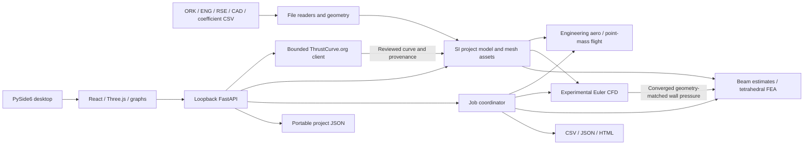

# Architecture

## Application boundary

Rocket Workbench is a local desktop application. QtWebEngine hosts a bundled
React interface; FastAPI serves that interface and a loopback JSON/multipart API.
Engineering code lives in independent Python modules. A background job layer
runs long calculations and reports state, progress, elapsed time, estimated time
remaining, cancellation and results. The Windows installer carries the runtime
and solvers rather than downloading executables after installation.
Only an explicit motor-catalog search/download contacts an external service;
all engineering calculations use local data.

## Modules and replaceable contracts

| Area | Responsibility |
| --- | --- |
| `models.py` | Validated project, component, material, motor, configuration, conditions and transform schemas |
| `imports.py` | Safe OpenRocket XML/container and thrust-curve readers, configuration mapping and explicit import warnings |
| `motor_catalog.py` | Explicit, bounded official motor-catalog requests, reviewed curve parsing and source/hash provenance |
| `geometry.py` | CAD tessellation, mesh diagnostics, procedural original geometry and attached replacement transforms |
| `alignment.py` | Read-only CAD placement proposals, preserved physical scale and adjacent axial gap/overlap diagnostics |
| `fea_setup.py` | Shared solid-admission and thickness/resource checks; read-only mesh-sizing preflight |
| `backenddiagnostics.py` | Cached numerical CUDA allocation/kernel probe, separate from viewport graphics support |
| `bundled_cuda.py` / `cuda_bundle_smoke.py` | Trusted frozen-library discovery before native imports; strict shipped-DLL/header/offline-compiler packaging checks |
| `desktop_preferences.py` | Bounded, atomic UI-only preference storage; pre-React restoration and close flushing across ephemeral desktop origins |
| `solvers/aero.py` | Atmosphere, mass properties, reference-geometry estimates and geometry-bound coefficient-table interpolation |
| `solvers/flight.py` | Passive launch/recovery integration, trajectory and event summaries |
| `solvers/structure.py` | Scoped beam/fin estimates and linear static solid FEA |
| `solvers/cfd.py` | Actual compressible Euler field solution and convergence output |
| `jobs.py` | Long-running job lifecycle, callbacks, sweeps, seeded Monte Carlo and export |
| `api.py` | Request validation, local-session access, project mutation, meshes and results |
| `main.py` | Desktop/headless startup, bundled assets and executable smoke check |
| `web/` | Resizable workspace, guided tutorials, term definitions, 3D interaction, computed flight playback, local map, plots and display-unit conversion |

[INTERFACES.md](INTERFACES.md) specifies method and API contracts. The UI does not
contain engineering equations. All stored quantities are SI; display-unit changes
do not change solver inputs. Rocket axial X runs from nose to tail with the YZ
cross-section. Transform rotations are XYZ Euler angles in degrees; translations
are in metres relative to the selected component's axial origin.

## Files, project state and replacement geometry

An import maps OpenRocket component hierarchy and configurations into a versioned
project model. Warnings describe unsupported assemblies, events and incomplete
motor data. No network lookup substitutes a thrust curve for a motor digest.
Users can supply local ENG/RSE files or explicitly search ThrustCurve.org's
official JSON API. A catalog motor digest/name is still not a thrust curve.
Search, file selection, curve preview and reviewed import are separate actions;
import adds a motor to the project and does not assign it to a configuration.
Downloaded motor data retains the reported source/license, fetch timestamp and
raw-curve SHA-256. Database source labels are provider claims, not independent
certification verification. Network failure leaves local file import available.

Unsupported geometry and event features are recorded per flight configuration,
alongside the overall import warning list. An inactive stage's motor cluster or
recovery event does not prevent analysis of another, supported configuration.
Imported configurations without a usable active recovery device require the user
to explicitly define recovery settings before flight simulation; placeholder
default parachute values never establish imported recovery physics.

STEP/STP is tessellated by Open CASCADE; STL/OBJ/PLY supply triangular assets.
Mesh input units are explicit; STEP's embedded units are honored by Open CASCADE.
Vertex coordinates become metres. The project saves
those vertices/faces along with alignment, component/material mappings and motor
curves. It is self-contained for repeated analysis, but it is not a CAD editing
system and does not preserve the original STEP boundary representation. Original
source CAD should be retained separately.

An attachment replaces a component's geometry through a transform and geometry
mode, while retaining the OpenRocket reference geometry for comparison. Watertight
geometry can contribute solid volume, mass and CG. Surface shells, overlaps and
solid-versus-thin-wall choices must be inspected; a watertight tessellation does
not by itself prove assembly/material correctness.

Automatic placement proposes a longitudinal axis from surface-area principal
moments, centers the part in Y/Z, and aligns its front or centre to the selected
reference part. Ambiguous principal axes use a deterministic source-bound axis;
nose direction is only a narrower-end shape guess. Source-axis, reverse and
manual transform controls remain available. Placement keeps physical dimensions
by default. Explicit fit-to-length applies a single uniform scale and therefore
changes dimensions, volume and computed mass. The proposal reports adjacent
axial gaps/overlaps but does not infer a bond, fastener, contact or solid union.

Replacement changes one component only. CFD rasterizes the assembled external
surfaces into a separate flow mask, treating closed interior air as nonflow.
It does not rewrite source CAD, fuse neighboring material meshes or create
structural connections. Open passages remain flow passages at the grid's
resolution; source cavities remain in mass and solid-FEA geometry.

Repeated non-fin component instances also repeat their aligned replacement CAD
geometry, with the source axial spacing; fin-set replacement assets represent the
selected set as a whole. Closed surface shells whose bounding boxes overlap
without containment are conservatively marked as having ambiguous material
volume. This can include nonintersecting complex shells with overlapping bounds;
the importer does not claim to perform a CAD Boolean union. Such geometry remains
available for viewing and CFD, while mass requires a measured override and solid
FEA requires an unambiguous closed source. Nested unitless mesh shells use an
explicitly warned even/odd material-versus-void interpretation; STEP preserves
its encoded shell orientation and refuses enclosed positive overlapping solids.
Geometry inspection and FEA retain these import reliability decisions after
project saving/loading rather than relying on triangle closure alone.

Arbitrary CAD does not silently become a valid Barrowman shape. The fast CP and
stability calculation identifies its original-geometry approximation. **New
project from CAD** creates an actual mesh component centered transversely with
its nose at X=0. Its circular bounding reference is for bookkeeping, not an
invented nose/fin aerodynamic model. Mass, CFD and component FEA use the mesh;
passive CAD-only flight requires a suitable supplied aerodynamic polar, motor,
mass/CG and recovery configuration.

## Supplied aerodynamic data

`/api/import/polar` reads UTF-8 CSV columns `mach,cd,cna,cp_m`, with optional
`source`. CD is dimensionless, CNa is a positive normal-force slope per radian,
and CP is metres from the rocket nose. Both coefficients must use the current
project's reference area (`reference_area_m2` in aerodynamic results). The
importer binds the rows to the selected flight configuration and a SHA-256
signature of active component dimensions, importer geometry metadata, asset
vertices/faces and transforms. Changing the shape invalidates the table;
material/mass changes leave aerodynamic shape binding intact.

The solver linearly interpolates within the table's Mach interval. Outside it,
the original-reference estimates return with warnings and per-trajectory
`polar_applied:false` flags. For CAD-only flight, supply coverage from zero to
the highest expected Mach so no unsupported placeholder region is relied on.
Signature matching proves which shape the user selected, not that the source
coefficients are correct. Supplied total coefficients do not resolve individual
component loads; that breakdown remains a reference estimate.

## One-way CFD pressure transfer

Numerical CFD and component FEA use transformed actual meshes within their
stated boundary/mesh/model limits. A completed, numerically converged CFD job
can supply wall pressure to FEA only while the selected geometry signature
still matches. The mapper selects nearby normal-compatible wall samples,
subtracts freestream pressure and preserves negative gauge suction. Unmapped
faces receive zero gauge pressure and the result reports mapped area fraction
and transfer distances. This nearest-sample mapping is not force-conservative;
check resultant forces and refine both discretizations.

This is one-way quasi-static loading. There is no deformation feedback into
the flow, coupled fluid-structure interaction, or automatic transient CFD/FEA
at every flight frame. Numerical CFD steadiness is separate from mesh/domain
convergence and physical validation. See [STRUCTURAL.md](STRUCTURAL.md) for
the boundary/load definitions and transfer diagnostics.

## Workspace, guidance and flight presentation

The interface separates assembly selection, the central view/results, and setup
controls. Users can resize or collapse the side panels and restore a default
layout. **Getting started** walks through the whole application; each workspace
has a **Tutorial**. Contextual question-mark definitions and the full user guide
are bundled frontend content and work without a network connection.

The red **Launch** action starts the same engineering flight job as other runs.
The application first computes the trajectory, then plays that recorded solution
from a rail above a flat plane. Trail, event positions and map locations use the
actual samples. A following camera yields to manual orbit/pan/zoom and resumes
after five seconds without input in follow mode. Rocket attitude remains
illustrative because the solver does not integrate attitude.

The follow view carries its relative framing with the recorded rocket position,
uses bounded velocity look-ahead and snaps to discontinuous timeline selections.
It does not smooth or change the trajectory. UI layout, tutorial progress and
named map points persist in a separate whitelisted JSON file. The authenticated
loopback origin still changes each launch, and the WebEngine profile stays in
memory; session tokens and unrelated browser storage are never persisted there.

The north-up map uses local east/north offsets from the launch pad. Numbered
event points of interest seek the recorded flight time; no satellite, terrain or
GPS service is implied.
Ground contact identifies a landing/impact; an incomplete trajectory shows its
last recorded position rather than inventing a final landing. Map/display units
convert presentation only and do not change the stored physical coordinates.

## Fidelity and GPU execution

Fast atmosphere/aero and point-mass flight use CPU calculations. The interactive
3D viewport uses GPU graphics. CFD and supported FEA linear algebra can use NVIDIA
CUDA via CuPy; results state the actual backend. Automatic mode may fall back to
CPU; an explicit GPU request reports missing capability. GPU speed is not a
substitute for mesh refinement or physical-model validation.

The cached capability check actually allocates device data and executes a small
float64 CUDA reduction. Its result includes the failed probe stage, diagnostic
reason, available device names and driver/runtime versions where obtainable.
It is cached until app restart so ordinary health polling does not repeatedly
compile kernels. A passed probe verifies this small numerical path, not a large
CFD grid's memory requirements or GPU performance for every solver.

The first-release model hierarchy is:

1. Engineering estimates for immediate feedback: small-angle reference geometry,
   drag surrogates and beam/fin formulas.
2. Passive point-mass flight with explicit single/dual recovery events, uniform
   wind and seeded perturbations. No attitude integration or weathercocking.
3. Linear isotropic tetrahedral static FEA with explicit loads and fixed boundaries.
4. Experimental first-order compressible inviscid Euler CFD on a Cartesian grid.

No part of the CFD model resolves wall shear or turbulence. FEA does not represent
composite laminate failure, plasticity, contact, buckling or flutter. Aero Mach
extensions are unvalidated engineering surrogates. These distinctions belong in
result metadata and the user interface, not only in developer documentation.

## Packaging and trust boundaries

Python and npm lockfiles pin dependency resolution. PyInstaller creates an onedir
Windows application so bundled shared libraries remain replaceable; Inno Setup
produces a single user-local installer. Native DLLs, QtWebEngine resources,
frontend assets, dependency metadata and application source snapshot are retained.
CUDA toolkit libraries are included in the standard build; device drivers are
provided by the machine owner.

A PyInstaller runtime hook registers only bundled CUDA DLL directories and
exposes the frozen resource root to cuda-pathfinder before importing CuPy.
It preserves the user's `CUDA_PATH`. The build and installed-executable checks
load the Qt/Windows runtime first, import actual CuPy native modules, discover
shipped headers and compile offline PTX. These checks fail on packaging errors
even without an NVIDIA device. Device execution remains a separate numerical
allocation/kernel probe and requires physical-hardware validation.

Desktop calls use a local-session token; normal development binds to loopback.
The optional motor client uses a fixed HTTPS service rather than accepting
arbitrary target URLs. It sends requested designation/manufacturer and selected
catalog/file IDs, not project geometry. Responses and downloaded curve data are
bounded and parsed as untrusted inputs. No model invents missing thrust points.
Uploads are untrusted inputs: the import layer uses safe XML parsing and bounded
resource handling. Project schemas reject invalid numbers; solvers additionally
validate physical prerequisites. Completed results are snapshots, not promises
that later project edits retroactively change a past run.

Progress is derived from solver steps/iterations and studies. For a bounded CFD
run it represents consumed work budget, not percentage converged; ETA estimates
the configured limit. Convergence-only CFD with no wall-clock limit has no known
completion percentage or ETA. The UI shows elapsed time, steps, physical domain
crossings and current residuals instead. A timed-out CFD job can complete its
software lifecycle while its returned flow field remains explicitly partial.
Cancellation is checked at safe solver boundaries. A grid/cell or tetrahedron
budget is a resource limit and must be reported instead of fabricating convergence.

Solid-FEA preflight constructs the selected actual triangle surface without
calling the native volume mesher. Its material, placed bounds, solid validity
and mesh-size/resource recommendations use the same admission checks as the
solver. It does not validate supports, loads, generated element quality or mesh
convergence. Thickness-resolving solid meshes can exceed the allowed budget on
whole thin rockets; the guard remains enforced. Beam/fin estimates are a separate
scoped model. Shell FEA and in-app region cutting are not implemented.
